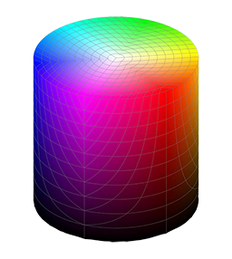

# Case study : Investigation and creation of digital badges

This case study was conducted by Aymen Fourati during the recrutement process with Playmakers.

## Description

The content of this repo is as follows : 

The two main features are : check_badge and create_badge.

The test_avatars file contains some data I have used to test the features.

## Table of Contents

- [Installation](#installation)
- [Usage](#usage)
- [Ideas](#ideas)

## Installation

To run any function you need to start by downloading the dependencies under the requierments.txt file : 

```bash
pip install -r requirements.txt
```

## Usage

You can simply run any of the main scripts : 

```bash
python3 check_badge.py source_file_path width height
```

```bash
python3 create_badge.py source_file_path width height
```
### Instructions : 

- It's possible to run the scripts without options : An exemple I have provided will run instead. 
- It's possible to not specify the width and height they are both set to 512 by default. 
- The output of the create_badge function is stored in the same folder as the input picture with a "_badge" suffix.


## Ideas

### Happy feeling 

Judging one's feeling towards a picture is undoubtedly very subjective. While in the RBG color space, we can not, at least not in a intuitive way, manipulate the *brightness* and the *saturation* of each color which I would say are the core elements to determine whether or not a pixel describes a happy feeling. Consequently, I have chosen to slide towards the HSV color space which is created by molding the RBG cube in a shape that is representative of these variables for each hue.



The rules for a happy pixel, as defined in this essay, are keeping either the saturation or the brightness (or both) equal to a high percentange to garentee bright and lively, joyful colors. I have also tried to include pastel colors ( low saturation and high brightness )

### Circle check

As for this task, I have tried to make the most time and space optimized solution and that is by limiting the number of pixels processed for each badge by predeteriming the coordinates to be processed on each entry ( for example, since we will be working exclusively on 512x512 pixels I have stored an array of the coordiantes of pixels figuring outside of the predefined circle to avoid computing that parameter more than once for all equally sized entries)

### Create badge

For each input file, I have tried to minimize the processing by making sure to only generate the steps that are not satisfied by the rules we have set; Meaning I will not resize a picture that is already in the right size or recolor one that has already a happy feeling communicated through it and same goes for the circle rule. 


